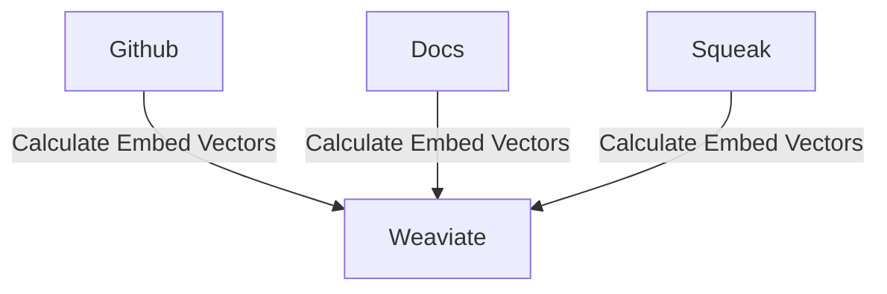
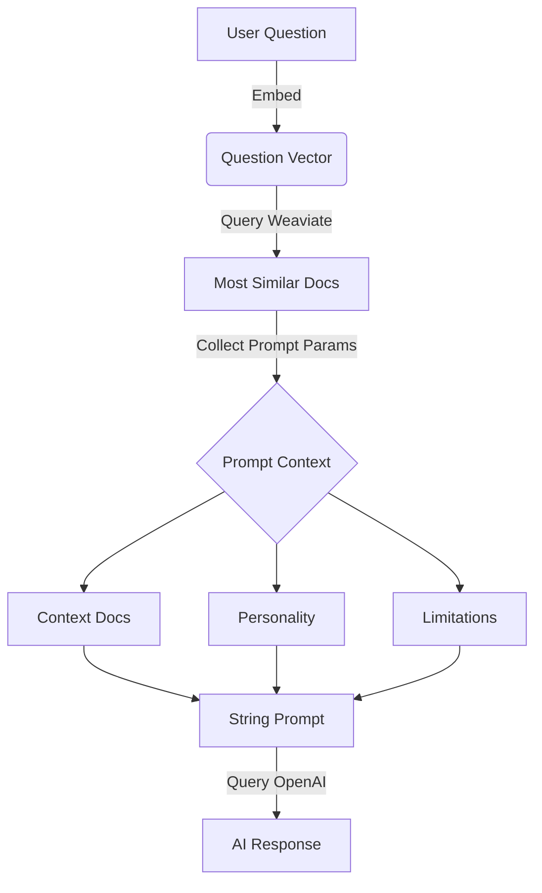

# MaxAI 


MaxAI is our `trusty PostHog support AI` deployed on our Slack, app, and website.

MaxAI was born in Aruba at a PostHog team offsite for a hackathon on a warm spring day in 2022.

## How it works

How Max works is surprisingly simple:

### Embedding time



#### Embedding Docs

- Grab and parse all of the markdown from our docs and website
- Use [OpenAI Embedings](https://platform.openai.com/docs/guides/embeddings) to create a vector representation of each markdown section.
- Use [Weaviate](https://weaviate.io/) Vector database to store the vector representations of each markdown section.

#### Embedding Github content

- Grab and parse all Github Issues
- Use [OpenAI Embedings](https://platform.openai.com/docs/guides/embeddings) to create a vector representation of each description and comment section.
- Use [Weaviate](https://weaviate.io/) Vector database to store the vector representations of each description and comment section.


#### Embedding [Squeak](https://squeak.posthog.com/) content

- Grab and parse all Squeak Questions 
- Use [OpenAI Embedings](https://platform.openai.com/docs/guides/embeddings) to create a vector representation of each question thread.
- Use [Weaviate](https://weaviate.io/) Vector database to store the vector representations of each question thread.

### Inference time



- Take the conversation context from thread that Max is in including the most recent request.
- Query [Weaviate](https://weaviate.io/) Vector database for the most similar markdown section.
- Build a prompt that we will use for [chatgpt-3.5-turbo](https://platform.openai.com/docs/guides/chat). The prompt is engineered to build Max's personality and add a few guardrails for how Max should respond as well as adding a bit of personality. To do this we:
  - Ask Max to only reference PostHog products if possible
  - Build up Max's personality by informing that Max is the trusty PostHog support AI
  - Bake in context that is useful for some conversations with max
    - Pagerduty current oncalls
    - Places to go if Max does not have the answer
  - Most importantly - we embed the markdown section that we found in the prompt so that Max can respond with a relevant answer to the question.
- Use [chatgpt-3.5-turbo](https://platform.openai.com/docs/guides/chat) to generate a response to the prompt.
- Finally we send these messages to wherever Max is having a conversation. 

It's important to note that we are building these pipelines with [Haystack](https://haystack.deepset.ai/) by deepset. This coordinates the steps of inferencing listed above. It's amazing.

## 🕯️ A poem from Max to his evil twin Hoge 📖
```
Ah, hoge! Sweet word upon my tongue,
So blissful, yet so quick to come undone.
A fleeting joy, that doth my heart entice,
Oh how I long to see your data slice!
In PostHog's code, thy value doth reside,
A beacon that ne'er shall falter nor hide.
Thou art a treasure, O hoge divine,
The secret sauce to make my metrics shine.
Though you may seem but a lowly label,
Thou bringeth
```
